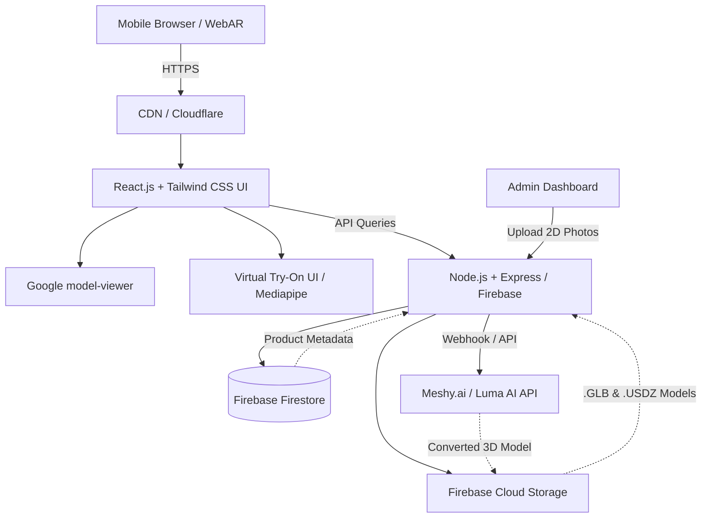

# System Architecture: SM Trader AR E-commerce & Digital Menu Platform

## Component Breakdown
1. **Frontend (React.js + Tailwind CSS)**
   - Responsible for the UI, fetching product data, and rendering the `UniversalARViewer`.
   - Optimized for mobile browsers (Chrome/Safari) which are dominant in Pakistan.
2. **AR Engine (`<model-viewer>`)**
   - Handles the rendering of `.GLB` (for Android) and `.USDZ` (for iOS) models.
   - Activates native AR capabilities (ARCore / ARKit) without requiring app downloads.
3. **Backend & Database (Node.js / Firebase)**
   - Firebase Firestore stores product details (name, price, category, model URLs).
   - Firebase Storage hosts the large 3D model files efficiently.
4. **AI Conversion Pipeline**
   - Node.js backend listens for image uploads from the Admin panel, sends them to Meshy.ai or Luma AI, and saves the resulting 3D models to Firebase Storage.
